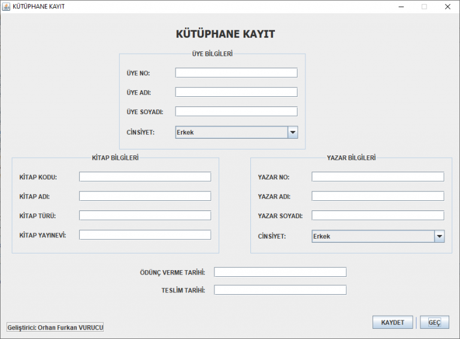
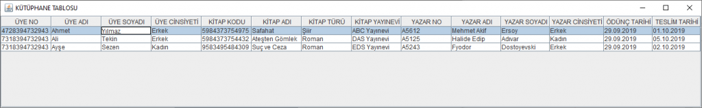
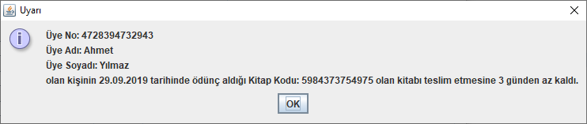
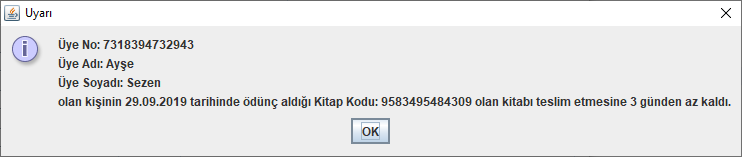
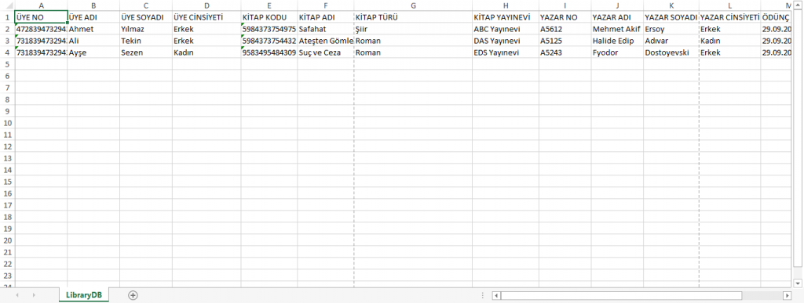

# Masaüstü Kütüphane Yazılımı

Java Programlama Dili kullanılarak geliştirilmiş olan Masaüstü Kütüphane Takip Programı kurumunuzun kütüphane kayıtlarını kaydetmenize, kaydettiğiniz verileri tablo halinde görüntülemenize ve kaydettiğiniz verilerin takibini yapmanıza yardımcı olur.

Programın Kayıt bölümünde Kütüphanenizin üye bilgilerini, kitap bilgilerini, yazar bilgilerini,ödünç verme tarihi ve teslim tarihi bilgilerini kaydedebileceğiniz alanlar mevcuttur. Burada gerekli bilgileri doldurduktan sonra KAYDET butonuna basmanız halinde veriler veritabanına kaydedilecektir.

Kütüphane bilgilerini doldurup veritabanına kaydettikten sonra GEÇ butonuna tıklayarak o an içinde veya daha önceden kaydetmiş olduğunuz tüm kayıtları tablo halinde görüntüleyebilirsiniz.

Not: Tabloda görmüş olduğunuz kayıtlar örnek mahiyetinde gösterilmektedir. 
 

Program, Kayıt sayfasına kaydetmiş olduğunuz ve Tablo sayfasında da görüntülemiş olduğunuz Kütüphanenizden kitap almış olan bir üyenin ödünç almış olduğu kitabı 3 gün ve daha az süre kala otomatik olarak uyarı verecek şekilde tasarlanmıştır. Bu sayede kütüphanenizden kitap almış olan üyelerin takibini yapabilirsiniz.

Program veritabanı olarak bir excel dosyasını kullanmaktadır. Bu sayede tutmuş olduğunuz kayıtların dökümünü yazıcıdan kolaylıkla alabilirsiniz. Programın bir sonraki sürümünde   programın anasayfasına konulması planlanan YAZDIR butonu ile veritabanının çıktısını almak amaçlanmaktadır.
  
